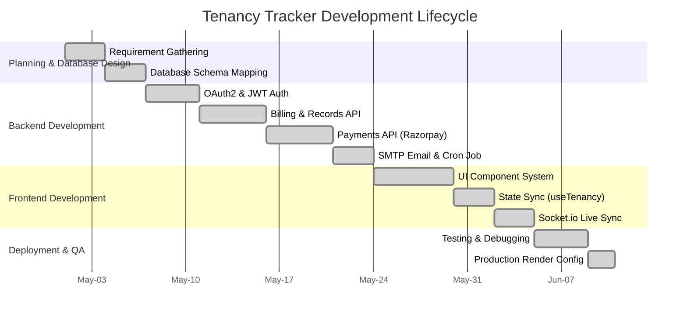
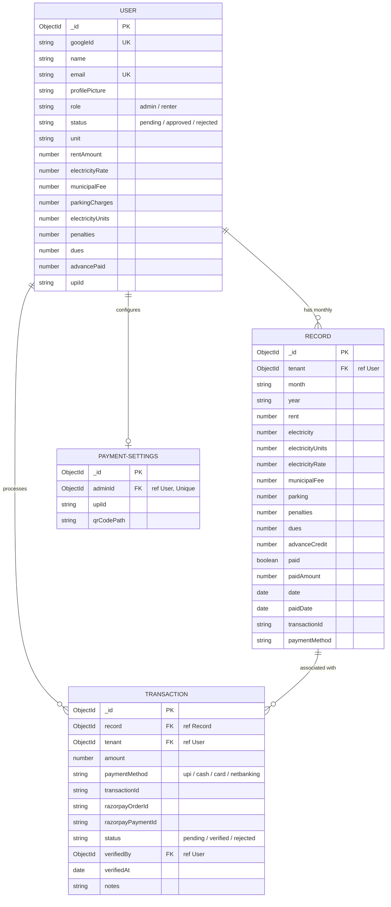
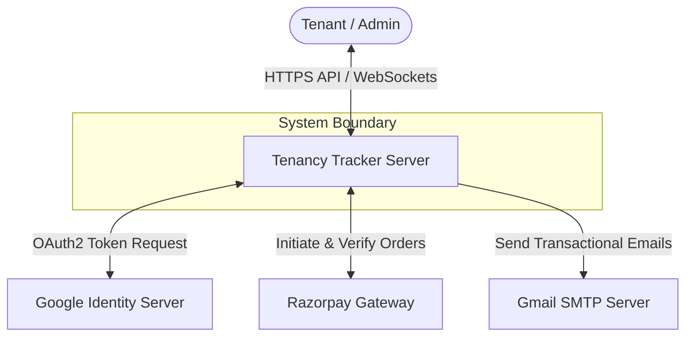
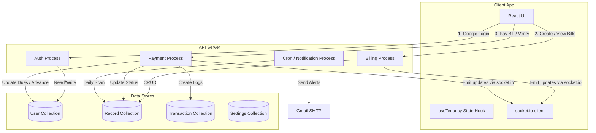
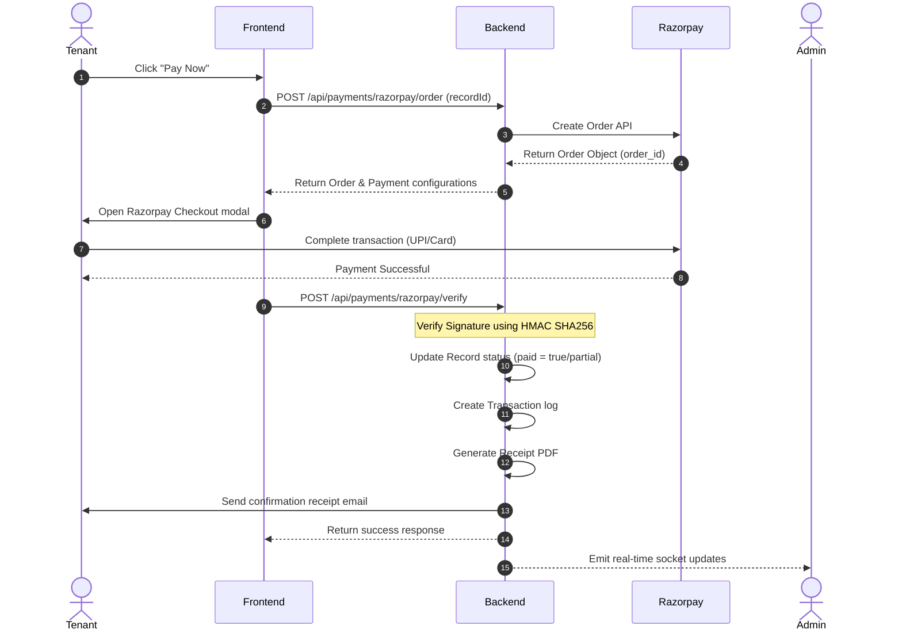

# 📄 Tenancy Tracker - Comprehensive System Documentation

## 📋 Table of Contents
1. [Project Overview & Objectives](#1-project-overview--objectives)
2. [Technology Stack](#2-technology-stack)
3. [Gantt Chart & Project Timeline](#3-gantt-chart--project-timeline)
4. [Database Models & ER Diagram](#4-database-models--er-diagram)
5. [Data Flow Diagrams (DFD)](#5-data-flow-diagrams-dfd)
6. [Core Code Flows & Processes](#6-core-code-flows--processes)
   - [Authentication & Account Authorization Flow](#authentication--account-authorization-flow)
   - [Monthly Billing Record Generation Flow](#monthly-billing-record-generation-flow)
   - [Payment Processing & Status Verification Flow](#payment-processing--status-verification-flow)
   - [Real-Time Updates Flow (WebSockets)](#real-time-updates-flow-websockets)
   - [Email Reminder Automation Flow](#email-reminder-automation-flow)
7. [Real-Time Websockets (Socket.io) Implementation Guide](#7-real-time-websockets-socketio-implementation-guide)
8. [API Endpoints Reference](#8-api-endpoints-reference)
9. [Frontend Components & Architecture](#9-frontend-components--architecture)
10. [Email Service & OAuth2 Troubleshooting Guide](#10-email-service--oauth2-troubleshooting-guide)
11. [Security Considerations & Performance Optimizations](#11-security-considerations--performance-optimizations)
12. [Folder and File Directory Structure](#12-folder-and-file-directory-structure)
13. [Installation & Local Setup Guide](#13-installation--local-setup-guide)

---

## 1. Project Overview & Objectives

**Tenancy Tracker** is a premium, real-time rental management platform designed to streamline landlord-tenant operations. It provides transparent financial logging, utility billing, automated payment reminders, secure online payments, and digital document delivery.

### Key Objectives:
- **Billing Transparency**: Automated computation of rent, electricity (unit-based), parking, and municipal fees.
- **Automated Communication**: Reminders to pay rent sent daily at 9:00 AM IST.
- **Multi-Method Payments**: Support for integrated Razorpay, UPI QR codes, Cash, and Bank Transfer with admin verification.
- **Real-Time Dashboards**: Landlord (Admin) and Tenant (Renter) portals updated instantly using Websockets (no page refresh required).
- **Auditable History**: Generation of PDF receipts, download capabilities, and full transaction logs.

---

## 2. Technology Stack

### Frontend Client
- **Framework & Language**: React 18.2 (TypeScript 5.3)
- **Tooling & Bundler**: Vite 7.2
- **Styling**: Tailwind CSS 3.3
- **Routing**: React Router DOM 7.11
- **Icons**: Lucide React
- **WebSocket Client**: socket.io-client 4.7
- **HTTP Client**: Axios 1.6

### Backend Server
- **Runtime Environment**: Node.js (ES Modules)
- **Framework**: Express 4.18
- **Database**: MongoDB (Mongoose 8.0 ODM)
- **Authentication**: Passport.js 0.7 (Google OAuth 2.0 Integration)
- **WebSockets**: socket.io 4.7
- **Payment Gateway**: Razorpay Node SDK 2.9
- **Email Service**: Nodemailer 8.0 (with OAuth2 Google APIs fallback)
- **PDF Generation**: PDFKit 0.18
- **Scheduling**: node-cron 4.2
- **File Uploads**: Multer 1.4

---

## 3. Gantt Chart & Project Timeline

The following Gantt chart represents the project's development cycle, milestones, and phases:



---

## 4. Database Models & ER Diagram

The system stores persistent information using four primary collections in MongoDB:



---

## 5. Data Flow Diagrams (DFD)

### Level 0 DFD: Context Diagram


### Level 1 DFD: Process & Repository Interaction


---

## 6. Core Code Flows & Processes

### Authentication & Account Authorization Flow
1. **Initiate Sign-In**: The user clicks "Sign In with Google" selecting their intended role (`tenants` or `admin`).
2. **Google Redirect**: The frontend redirects the user to `/auth/google` with query parameters.
3. **Passport Authorization**: The backend passes the request to Google's OAuth consent screen.
4. **Google Identity Verification**: The user approves identity sharing. Google returns profile details to `/auth/google/callback`.
5. **Database Sync**: The backend checks if the email is in the `User` database.
   - If user does not exist, a new profile is created with `status: 'pending'` and `role: 'renter'`.
   - If the user's email exists in the `ADMIN_EMAILS` env config, their role is set to `admin` and `status: 'approved'`.
6. **JWT Generation**: A JWT is signed containing the user ID, email, and role, set as an HTTP-only cookie.
7. **Redirection & Switch**: The client is redirected to `/dashboard`.
   - If `status === 'pending'`, the user is routed to the `PendingApproval` screen.
   - If `status === 'approved'`, the `DashboardSwitcher` renders `AdminDashboard` or `RenterDashboard` based on role.

### Monthly Billing Record Generation Flow
1. **Initiate Bill**: The admin selects an approved renter and enters utility stats (e.g., electricity units).
2. **Form Calculations**: The frontend calculates charges:
   $$\text{Total Bill} = \text{Rent} + (\text{Units} \times \text{Rate}) + \text{Municipal Fee} + \text{Parking} + \text{Penalties} + \text{Dues} - \text{Advance Credit}$$
3. **Submit Request**: The client sends a `POST /api/records` request.
4. **Validation**: The backend validates that:
   - The billing tenant is valid.
   - The billing period matches the current month and year.
5. **Database Write**: The backend checks for an existing unpaid record for that month/year.
   - If it exists, fields are updated (upsert).
   - If it does not exist, a new `Record` is created.
6. **Real-time Event**: A socket event `record_created` or `record_updated` is emitted to all logged-in administrators and the specific tenant room.
7. **Email Notification**: An HTML invoice email detailing all charges is dispatched asynchronously.

### Payment Processing & Status Verification Flow


*For manual payments (UPI QR, Cash, Bank Transfer), the tenant initiates the transfer externally, then requests verification. The transaction enters a `pending` state until the Admin marks it as `verified` on the dashboard.*

### Real-Time Updates Flow (WebSockets)
1. **Client Connection**: When the user opens the application, `useTenancy.ts` establishes a persistent connection to the server using `socket.io-client`.
2. **Room Entry**: The client emits `join_room` with their `userId`. The socket instance joins that private room.
3. **Backend Emits**:
   - For global updates (e.g. creating/deleting records, user approval updates), the backend server emits to the entire pool: `io.emit('record_created', record)`.
   - For private updates, the backend emits to the specific user's room: `io.to(tenantId).emit('payment_receipt_generated', record)`.
4. **State Hydration**: When the frontend client receives a socket event, the state arrays (`records`, `users`, `receipts`) are updated in-place via React state modifiers, triggering clean UI updates without full page reloads.

### Email Reminder Automation Flow
1. **Task Trigger**: A `node-cron` job runs daily at 9:00 AM IST.
2. **Database Scan**: The job queries the `Record` collection for all records where `paid: false` and the current date is past the due date (10th of the month).
3. **Tenant Lookup**: Populates the `tenant` schema to retrieve their email address.
4. **Email Dispatch**: Loops through the overdue list and dispatches customized warning emails using `Nodemailer`.
5. **Failover**: If the primary admin's SMTP credentials fail, the service automatically switches to the backup admin's SMTP config to ensure reliability.

---

## 7. Real-Time Websockets (Socket.io) Implementation Guide

### Connection Lifecycle Management
To prevent memory leaks, browser slowdowns, and duplicate event triggers, socket event bindings must be managed carefully.

- **Establishment**: Initialize the socket instance once using a singleton helper in the frontend.
- **Cleanup Requirement**: When React components unmount, all registered listeners must be detached using `socket.off(eventName, handler)`.

#### Correct Event Handler Binding Pattern:
```tsx
import { useEffect } from 'react';
import { Socket } from 'socket.io-client';

export default function RecordComponent({ socket }: { socket: Socket | null }) {
  useEffect(() => {
    if (!socket) return;

    // Define the handler locally or as a useCallback
    const handleRecordUpdated = (updatedRecord: any) => {
        console.log("Record Updated:", updatedRecord);
        // Modify local state
    };

    // Attach listener
    socket.on('record_updated', handleRecordUpdated);

    // 🟢 Cleanup: Unsubscribe listener when component unmounts
    return () => {
        socket.off('record_updated', handleRecordUpdated);
    };
  }, [socket]);
}
```

---

## 8. API Endpoints Reference

### Authentication Routes (`/auth`)
- `GET /auth/google` - Initiates Google OAuth redirection.
- `GET /auth/google/callback` - Callback URL processing user login and returning a JWT token.
- `GET /auth/me` - Validates JWT cookie and returns authenticated user object.
- `POST /auth/logout` - Clears cookie.

### Renter & User Routes (`/api/users`)
- `GET /api/users/tenants` - Returns all renters (Approved, pending, or rejected) for Admin.
- `PATCH /api/users/:id/approve` - Approve a pending tenant's account.
- `PATCH /api/users/:id/reject` - Reject a tenant's account.
- `PATCH /api/users/:id` - Updates details (e.g. rent amounts, security deposits).
- `POST /api/users/upload-picture` - Uploads profile pictures.
- `DELETE /api/users/:id` - Deletes a tenant, their receipts, and billing history.

### Billing Records Routes (`/api/records`)
- `GET /api/records` - Fetch billing records.
- `GET /api/records/tenant/:id` - Get records for a specific tenant.
- `POST /api/records` - Creates/Updates a monthly bill.
- `PUT /api/records/:id` - Complete modification of billing items.
- `PATCH /api/records/:id/status` - Mark a record's payment status (e.g. manual payment verification).
- `DELETE /api/records/:id` - Deletes billing records.

### Payment Routes (`/api/payments`)
- `GET /api/payments/settings` - Retrieve admin payment configurations (UPI & QR Code).
- `POST /api/payments/settings` - Upload/Update payment configuration.
- `POST /api/payments/razorpay/order` - Generates a Razorpay order ID.
- `POST /api/payments/razorpay/verify` - Verifies online signatures.

---

## 9. Frontend Components & Architecture

### React Router Page Mapping
- `/` $\rightarrow$ Landing page with OAuth action selections.
- `/login` $\rightarrow$ Toggle selector roles for signup.
- `/pending-approval` $\rightarrow$ Visual gate for unapproved tenants.
- `/dashboard` $\rightarrow$ Role-based rendering entry point.

### Component Structure Hierarchy
```
App.tsx
├── PublicHome (Landing UI)
├── LoginScreen (Auth triggers)
├── PendingApproval (Gatekeeper view)
└── DashboardSwitcher
    ├── AdminDashboard (Admin View)
    │   ├── Overview/Records Table (State Filtering)
    │   ├── Tenants Management Table
    │   ├── Security Deposit Tracking Table
    │   ├── Receipts Log Table
    │   ├── Late Payments & Penalties Panel
    │   ├── AddRecordModal
    │   └── NotificationsPanel
    │
    └── RenterDashboard (Renter View)
        ├── Account Balance Overview Card
        ├── Billing History Table
        ├── PaymentPage Modal
        └── ProfilePictureUpload
```

---

## 10. Email Service & OAuth2 Troubleshooting Guide

### Issue Diagnosis
If logs display: `GaxiosError: invalid_grant - Token has been expired or revoked.`
It indicates that the Google OAuth2 Refresh Token used by Nodemailer has expired. This commonly occurs because:
1. The Google Cloud Project is set to **"Testing"** status, which auto-expires tokens every 7 days.
2. The administrator changed their Gmail account password.

---

### Step-by-Step Fixes

#### Step 1: Change Google Cloud App Status to "Production"
1. Open the [Google Cloud Console](https://console.cloud.google.com/).
2. Navigate to **APIs & Services** $\rightarrow$ **OAuth consent screen**.
3. Under **Publishing status**, click **"Publish App"** and confirm.
   > [!NOTE]
   > Changing publishing status to production removes the 7-day token expiration limit. Verification is not needed to publish.

#### Step 2: Regenerate Refresh Token using OAuth Playground
1. Open [Google OAuth Playground](https://developers.google.com/oauthplayground/).
2. Click the gear icon (Settings) in the top right:
   - Check **"Use your own OAuth credentials"**.
   - Input your `GOOGLE_CLIENT_ID` and `GOOGLE_CLIENT_SECRET` (found in backend `.env`).
3. Under Step 1 on the left side, enter the scope: `https://mail.google.com/`.
4. Click **Authorize APIs** and select your administrator email account. Click **Allow**.
5. Under Step 2, click **Exchange authorization code for tokens**.
6. Copy the newly generated **Refresh token** value.

#### Step 3: Update local/deployment variables
Update the following keys in your backend `.env` or hosting provider settings:
```env
ADMIN_SAHIL_REFRESH_TOKEN=your_new_refresh_token_value
```
Restart the server to apply the changes.

---

## 11. Security Considerations & Performance Optimizations

### Security Practices
- **Middleware Gates**: Every backend endpoint requires validation through `protect`, `approvedOnly`, and `adminOnly` middlewares to prevent unauthorized access.
- **Payload Limits**: File uploads (QR codes, profile photos) are restricted to `5MB` using Multer.
- **Payment Verification**: Manual payments require verification by an administrator. Online transactions are verified cryptographically via Razorpay Webhook Signatures (`HMAC-SHA256`).

### Performance Details
- **Compound Database Indexing**: Compound index `tenant_1_year_1_month_1` prevents double billing and speeds up lookups.
- **Populate Optimization**: Mongoose populates only necessary tenant fields (`name`, `email`, `unit`, `rentAmount`) to minimize payload size.
- **State Batching**: Component state updates are batched inside the WebSockets lifecycle to reduce unnecessary re-renders.

---

## 12. Folder and File Directory Structure

```
tenancy-tracker/
├── render.yaml                           # Deploy setup for Render.com
│
├── backend/                              # NodeJS API App
│   ├── index.js                          # Express app entry & server start
│   ├── package.json                      # Server package dependencies
│   │
│   ├── config/
│   │   └── passport.js                   # Google OAuth strategy configuration
│   │
│   ├── middleware/
│   │   └── auth.js                       # JWT decode & authentication gates
│   │
│   ├── models/
│   │   ├── User.js                       # User model schema
│   │   ├── Record.js                     # Billing records model schema
│   │   ├── Transaction.js                # Receipts model schema
│   │   └── PaymentSettings.js            # Payment QR/UPI model schema
│   │
│   ├── routes/
│   │   ├── auth.js                       # OAuth signup routes
│   │   ├── users.js                      # User profile operations
│   │   ├── records.js                    # Billing calculations
│   │   └── payments.js                   # Razorpay API routes
│   │
│   └── utils/
│       ├── emailService.js               # Mail transmission core
│       ├── emailTemplates.js             # Structured HTML templates
│       ├── pdfService.js                 # PDF invoice generation
│       └── cronService.js                # Daily payment scans
│
└── frontend/                             # React SPA Client
    ├── package.json                      # Client libraries
    ├── vite.config.ts                    # Vite pipeline settings
    ├── App.tsx                           # Main app component & routes
    │
    ├── components/
    │   ├── LoginScreen.tsx               # Entry UI
    │   ├── DashboardSwitcher.tsx         # User type routing
    │   ├── AdminDashboard.tsx            # Landlord view
    │   ├── RenterDashboard.tsx           # Tenant view
    │   └── TenantBillingPage.tsx         # Detailed dues list
    │
    ├── hooks/
    │   └── useTenancy.ts                 # React hook managing global state
    │
    └── utils/
        ├── api.ts                        # Axios configuration
        └── currency.ts                   # Currency formatter (INR)
```

---

## 13. Installation & Local Setup Guide

### Prerequisites
- Node.js installed locally.
- A running MongoDB instance (or MongoDB Atlas connection URI).
- Google Cloud OAuth credentials and Razorpay test credentials.

### Backend Setup
1. Open your terminal in the backend directory:
   ```bash
   cd backend
   npm install
   ```
2. Create a `.env` file in the `backend/` directory:
   ```env
   PORT=5000
   NODE_ENV=development
   MONGODB_URI=your_mongodb_connection_uri
   GOOGLE_CLIENT_ID=your_google_client_id
   GOOGLE_CLIENT_SECRET=your_google_client_secret
   GOOGLE_CALLBACK_URL=http://localhost:5000/auth/google/callback
   FRONTEND_URL=http://localhost:5173
   ADMIN_EMAILS=rajawatsahil256@gmail.com
   JWT_SECRET=your_jwt_secret_key
   ```
3. Start the server:
   ```bash
   npm run dev
   ```

### Frontend Setup
1. Open a new terminal in the frontend directory:
   ```bash
   cd frontend
   npm install
   ```
2. Start the development server:
   ```bash
   npm run dev
   ```
3. Open `http://localhost:5173` in your browser.
